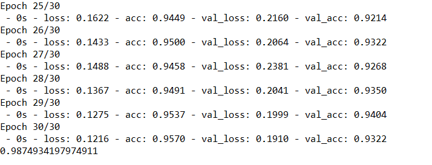
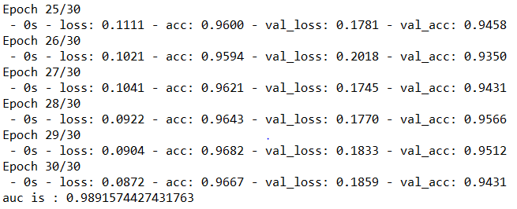

# 使用迁移学习做一个简单的baseline
## 实验环境
* 系统：windows
* 编辑器：spyder
* 工具：keras  

## 总体思路
* 使用inceptionv3等模型，在训练集和验证集上提取出特征和label并作为h5进行保存。可以使用多个模型保存特征。提取出特征后，构建两层神经网络做分类器。进行训练，训练速度很快。总共只需5分钟就能得到一个94%的分类器。
* 修改keras中自带的resize方法，改成antialias,原有方法会产生纹波.  

## 实验内容
* 5种不同的花图片，共3600张。分别放在5个文件夹中，取10%作为验证集，使用inceptionv3,vgg16,residual50提取特征。
* 
* 
* 
* 
* 

## 具体步骤
* 数据集：[链接](http://download.tensorflow.org/example_images/flower_photos.tgz)
* divide_trainAndval.py将原文件夹，切分成train和val两个文件夹。  
* inceptionv3,inceptionv3,vgg16,residual50提取特征,代码:

```python
basic_model = inception_v3.Inception_V3(include_top = False,weight = 'imagenet')
feature = GlobalAveragePooling2D()(basic_model.output)
model = models(inputs = basic_model.input,outputs = feature)
f = model.predict(data)	  #f即为提取出的特征。
```  

* data使用ImageDataGenerator()和gen.flow\_from\_direction产生.其中keras自带的resize方法很差，会对图片产生纹波，换成interpolation='antialias'。这个需要在keras里面进行修改，在"C:\Users\tunan\AppData\Local\Continuum\anaconda3\envs\tensorflow\lib\site-packages\keras_preprocessing\image.py"文件第34行加入`'antialias':pil_image.ANTIALIAS`

```python
gen = ImageDataGenerator()
train_gen = gen.flow_from_directory(r"data\valAndTrain\train",
                                    shuffle = False,batch_size = 16,
                                    class_mode = 'categorical',
                                    target_size = input_size,
                                    interpolation='antialias',
                                     )
data,label = train_gen.next()	  #取出每次的数据和标签
```

* 用h5py的方法储存提取出的特征。与直接用np.array写入文件的好处是，不用一次写入文件，分批次写入速度更快。而且写入是以字典的形式，容易读取。  

```python  #上下对齐，反上斜点。
dt = h5py.special_dtype(vlen = str)
with h5py.File("data\\feature") as h:
    h.create_dataset("train", data=train_feature)
    h.create_dataset("val", data=val_feature) 
    h.create_dataset('test',data = test_feature)
    h.create_dataset("train_labels", data=train_labels)
    h.create_dataset("val_labels", data=val_labels)
    ds = h.create_dataset('file_name',test_name.shape,dtype = dt)
    ds[:] = test_name
```  

* 该代码块用字典的方式将train\_feature,val\_feature等变量储存到h5文件中。  
  存储代码:1、h = h5py.File("name")  
  2、h.create\_dataset("train",data = train\_feature)  
  3、储存字符串，dt = h5py.special\_dtype(vlen = str);   #定义类型  
     ds = h.create\_dataset('file_name',test_name.shape,dtype = dt) #定义变量，大小和类型  
     ds[:] = test_name   #对其赋值
* 读取方式:
  1、h = h5py.File('name','r')  
  2、train\_feature = np.array(h[train_feature])

## 结果  
* 训练速度很快，在2000张图片（400\*400）时只用5分钟即可完成所有训练。而使用完整的迁移学习+数据增强+fine tune 需要**10个小时**才能得到最终结果。因此该方法适合做一个迁移学习的baseline，查看迁移学习是否有效。
* 特征提取3300张图片共需要5分钟，使用提取好的特征进行训练很快，几乎秒完成。结果：训练集上的正确率：95.07%，验证集上的正确率：93.22% (注：有时候会出现很差的情况，无法训练，故需要多训练两次看结果)
  
* 使用多一层的dense（512），结果变好一些。96.67%，验证集上的正确率：94.21%。这里可以看出多使用一层有明显提升。
 


